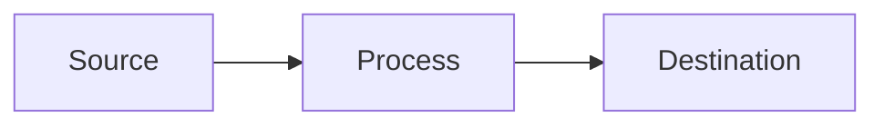

# Devops-Dojo — CLAUDE.md

## Project Overview

A DevOps knowledge base and blog powered by **Quartz 4.3.0** (static site generator). Content is written in Obsidian-flavored Markdown and deployed to [devops-dojo.ninja](https://devops-dojo.ninja) via Vercel.

Author: **Kumail Rizvi** — [linkedin.com/in/kumail-rizvi](https://linkedin.com/in/kumail-rizvi)

---

## Tech Stack

| Layer | Tool |
|---|---|
| SSG | Quartz 4.3.0 (TypeScript/Node.js) |
| Markdown | Obsidian Flavored Markdown (OFM) + GFM |
| Deployment | Vercel (via GitHub Actions on push to `v4`) |
| Local dev | Docker Compose (Node app on :3000, Postgres :5432, Redis :6380) |
| CI | GitHub Actions — lint, type-check, build on PRs to `v4` |

---

## Repository Structure

```
/
├── content/               # All blog posts and pages
│   ├── index.md           # Home page
│   ├── Portfolio.md
│   ├── AWS/               # AWS service posts
│   │   ├── Compute/       # EC2, ECS, Lambda, ASG, Load Balancer
│   │   ├── Database/
│   │   ├── Disaster Recovery/
│   │   ├── Networking/
│   │   ├── Security/
│   │   └── Storage/       # S3, EFS, DataSync, Parameter Store
│   ├── Cloud-Native/
│   ├── Helm/
│   ├── IAC/               # Terraform, CDK, etc.
│   ├── Kubernetes/
│   ├── Security/
│   └── System Design/
├── quartz/                # Quartz framework (don't modify unless extending)
├── quartz.config.ts       # Main Quartz config (plugins, theme, etc.)
├── quartz.layout.ts       # Page layout definitions
├── public/                # Static build output (generated)
├── .github/workflows/     # CI (ci.yaml) and deployment (deployment.yml)
├── docker-compose.yml
└── Dockerfile
```

---

## Writing Blog Posts

### File Location

Place posts in `content/<Category>/Post Name.md`. Use spaces in filenames — Quartz handles them correctly. Each category folder can have an `assets/` subfolder for images.

### Frontmatter Template

```yaml
---
Author:
  - Kumail Rizvi
Author Profile:
  - https://linkedin.com/in/kumail-rizvi
tags:
  - AWS          # use lowercase or PascalCase consistently per section
  - S3
Creation Date: 2026-01-15T10:00:00
Last Date: 2026-01-15T10:00:00
DocID: XX-26     # optional: 2-letter prefix + year, e.g. SR-26, EC-26
drafts: false    # empty string or false = published; true = draft
References:
  - https://docs.aws.amazon.com/...
description: One-sentence summary used for link previews.
Github Link:     # optional: link to related repo
---
```

### Content Format Rules

- **Diagrams:** Use Mermaid fenced code blocks (` ```mermaid `) — Quartz renders them client-side. For static PNGs, store in `content/<Category>/assets/` and embed with `![[filename.png]]`.
- **Callouts:** Obsidian syntax — `> [!NOTE]`, `> [!TIP]`, `> [!CAUTION]`, `> [!INFO]`, `> [!WARNING]`
- **Internal links:** Wikilink syntax `[[Page Name]]` or `[[Page Name|Display Text]]`
- **Code blocks:** Always specify the language — ` ```bash `, ` ```json `, ` ```yaml `, etc.
- **Images:** `![[image.png]]` — relative to the content directory; Quartz resolves them

### DocID Convention

`{2-letter topic prefix}-{2-digit year}` — e.g.:
- `SR-26` = S3 Replication, 2026
- `EC-26` = ECR, 2026
- `KGC-24` = Kubernetes Grafana Cloud, 2024

---

## Architecture Diagrams

Quartz supports **Mermaid** natively (enabled in `quartz/plugins/transformers/ofm.ts`). Prefer Mermaid for new diagrams.



For more complex diagrams needing precise layout, export as PNG from draw.io and store the `.drawio` source + `.png` export in `content/<Category>/assets/`. Embed the PNG with `![[filename.png]]`.

---

## Local Development

```bash
# Install dependencies
npm ci

# Start local dev server (hot reload)
npx quartz build --serve

# Type check
npm run check

# Build for production
npx quartz build
```

Or use Docker:
```bash
docker compose up
# App available at http://localhost:3000
```

---

## Deployment

Push to the `v4` branch triggers the GitHub Actions deployment workflow:
1. Builds with `npx quartz build`
2. Deploys to Vercel using `VERCEL_TOKEN`, `VERCEL_ORG_ID`, `VERCEL_PROJECT_ID` secrets

Manual deploy:
```bash
npx vercel --prod
```

---

## Content Categories & Tags

| Directory | Typical Tags |
|---|---|
| `AWS/Compute/` | `AWS`, `EC2`, `ECS`, `Lambda`, `ASG` |
| `AWS/Storage/` | `AWS`, `S3`, `EFS`, `Storage` |
| `AWS/Networking/` | `AWS`, `VPC`, `Networking` |
| `AWS/Security/` | `AWS`, `Security`, `IAM` |
| `AWS/Database/` | `AWS`, `RDS`, `DynamoDB` |
| `Kubernetes/` | `Kubernetes`, `k8s` |
| `IAC/` | `Terraform`, `CDK`, `IaC` |
| `Security/` | `Security`, `docker` |
| `System Design/` | `System Design` |
| `AI/` | `AI`, `Agents`, `Claude`, `Homelab` |

---

## Key Files to Know

| File | Purpose |
|---|---|
| `quartz.config.ts` | Plugin config, site metadata, Mermaid toggle, base URL |
| `quartz.layout.ts` | Sidebar, TOC, footer layout |
| `content/index.md` | Homepage content |
| `.github/workflows/deployment.yml` | Vercel deploy pipeline |
| `.github/workflows/ci.yaml` | PR checks (lint, typecheck, build) |
| `docker-compose.yml` | Local dev environment |
