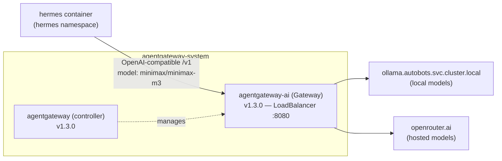
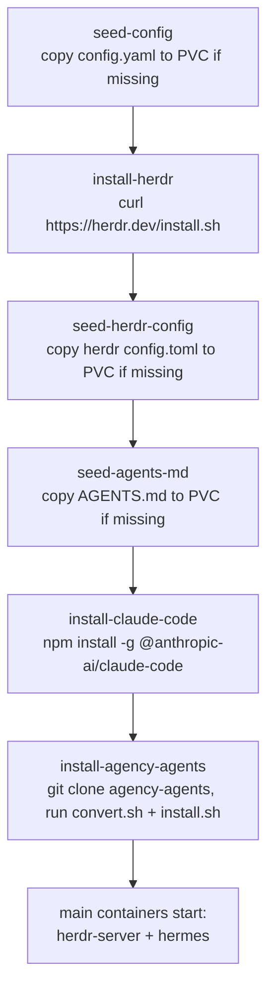

---
Author:
  - Kumail Rizvi
Author Profile:
  - https://linkedin.com/in/kumail-rizvi
tags:
  - AI
  - Kubernetes
  - Claude
  - Homelab
  - Agents
Creation Date: 2026-08-03T00:00:00
Last Date: 2026-08-03T00:00:00
DocID: HH-26
drafts: false
References:
  - https://herdr.dev
  - https://github.com/msitarzewski/agency-agents
  - https://agentgateway.dev
description: How I wired Telegram, Herdr, Hermes, Claude Code, Notion, and a self-hosted AgentGateway together on my Kubernetes homelab so I can hand off real coding work from my phone and have it run unattended.
---

## Abstract
---

I wanted to text a coding task to my phone, close the app, and come back later to find it either done or blocked with a clear reason why — no laptop staying open, no terminal session I have to babysit. So I put together a small stack for it: Herdr keeps agent sessions alive in the background, Hermes is what actually talks to Telegram, Claude Code does the real coding work, a Notion board tracks what's in flight, and a self-hosted AgentGateway handles the model calls Hermes makes on its own behalf. All of it runs as one pod in a `hermes` namespace on my homelab cluster, deployed through ArgoCD like everything else there.

Here's how it actually works, piece by piece.

## The Problem
---

Coding agents are good at long, unattended work, but almost all of them assume you're sitting at a terminal. Close the laptop and the session's gone. And if you want to kick something off from your phone, there's usually no good way in that isn't "remote into a desktop and open a terminal there."

What I actually wanted was pretty simple: send a task from Telegram, since that's where I already am. Sessions that don't die just because I disconnected. And somewhere to actually check what's in flight, rather than scrolling back through a chat thread trying to remember what I asked for.

## Architecture
---

![[herdr-hermes-pipeline.png]]

At the center of this is a single Kubernetes Deployment (`hermes`, in the `hermes` namespace) running two containers that share a persistent volume:

![[hermes-pipeline.png]]

Two things here are easy to miss if you're skimming the diagram:

> [!note] Two different model paths
> Hermes has its own "brain" for deciding what to do with an incoming Telegram message, and it's a small model (`minimax/minimax-m3`) routed through my self-hosted AgentGateway. The actual coding work is a separate thing entirely — once Hermes hands it off to Claude Code via Herdr, that goes straight to Anthropic's API using a Claude Code OAuth token. So there are two model calls happening for one task, and they're doing different jobs: Hermes figuring out what should happen, Claude Code actually doing it.

> [!note] `strategy: Recreate`, not `RollingUpdate`
> The Deployment is pinned to `replicas: 1` with `strategy: Recreate`. Herdr sessions are stateful PTYs living on a single pod, so running two replicas would mean two independent session stores, and a rolling update would briefly run old and new pods side by side. `Recreate` just makes sure the old pod is fully gone before the new one starts, so there's never a split-brain session state.

## The Components
---

### Herdr — persistent sessions for coding agents

[Herdr](https://herdr.dev) is the piece that solves "the agent's work shouldn't die when I disconnect." It's a small server (`herdr server`, running as the `herdr-server` sidecar container) that manages long-lived terminal sessions, conceptually similar to `tmux`, but exposed over a socket API instead of a raw PTY and built specifically with coding agents in mind.

The instructions baked into this pod's `AGENTS.md` describe it plainly:

```
herdr is installed on PATH and its server runs continuously in a
sidecar container in this pod. Use it to run long-lived coding-agent
work (e.g. Claude Code, OpenCode) that should keep running in the
background and survive you disconnecting or this agent restarting.
```

The commands the agent actually has available:
- `herdr session attach <name>` — attach to (or create) a named persistent session
- `herdr pane <subcommand>` — spawn a pane, send input, read output over the socket API, no interactive terminal needed
- `herdr agent <subcommand>` — agent/terminal helpers
- `herdr status` — client/server status

Its config (`/opt/data/herdr/config.toml`) is about as minimal as it gets:

```toml
[session]
resume_agents_on_restore = true

[experimental]
pane_history = true
```

Both settings are doing real work for the "survives restarts" claim: `resume_agents_on_restore` reattaches running agent sessions after the server comes back up, and `pane_history` keeps scrollback across restarts so context doesn't just vanish.

### Hermes — the Telegram gateway

The `hermes` container is the other half of the pod, running `hermes gateway run`. This is what actually talks to Telegram, exposes a small dashboard (port `9119`, basic-auth protected) and an API server (port `8642`, key-protected), and decides — based on the `AGENTS.md` context it's given — when to reach for Herdr versus just answering directly.

Environment-wise, it's wired up with:

| Variable | Purpose |
|---|---|
| `TELEGRAM_BOT_TOKEN` / `TELEGRAM_ALLOWED_USERS` | Bot auth plus an allowlist, so only I can drive it |
| `NOTION_API_KEY` | Read/write access to the ticket board |
| `CLAUDE_CODE_OAUTH_TOKEN` | Shared with `herdr-server` so Claude Code can authenticate |
| `HERMES_DASHBOARD*` / `DASHBOARD_USERNAME` / `DASHBOARD_PASSWORD` | Web dashboard for checking in on sessions outside Telegram |
| `API_SERVER_KEY` | Auth for Hermes' own HTTP API |

All of it lives in a single `hermes-secrets` Kubernetes Secret, pulled in via `secretKeyRef` rather than baked into the image or a configmap.

### AgentGateway — a self-hosted AI gateway

Separately, in an `agentgateway-system` namespace, I run [AgentGateway](https://agentgateway.dev) — an actual [Gateway API](https://gateway-api.sigs.k8s.io/) implementation built for AI traffic. It's not part of the Hermes pod at all. It's shared infrastructure that Hermes' own reasoning model just happens to route through:



Hermes' own `config.yaml` just points at it directly:

```yaml
model:
  provider: custom
  model: minimax/minimax-m3
  base_url: http://agentgateway-ai.agentgateway-system.svc.cluster.local:8080/v1
  api_key: "none"
```

The gateway fronts both a local Ollama instance and OpenRouter, so which backend actually serves a given model is a routing decision made at the gateway, not something Hermes has to think about. And `api_key: "none"` is correct, not a mistake — auth happens at the gateway boundary inside the cluster, not per caller.

### The 269-agent roster

Bundled in through an init container is [agency-agents](https://github.com/msitarzewski/agency-agents), an open-source collection of specialist agent personas organized by department — engineering, marketing, sales, finance, product, design, support, security, testing, plus a handful of more niche ones like GIS, healthcare, game development, and spatial computing. I actually counted the persona files on disk across those division directories out of curiosity, and it comes out to 269. Which is exactly the number in the diagram above — nice to see the two line up.

Instead of loading all 269 into context at once, there's a small router plugin (`agency-agents-router`) that exposes four tools:

```yaml
name: agency-agents-router
provides_tools:
  - agency_agents_search
  - agency_agents_inspect
  - agency_agents_load
  - agency_agents_delegate
```

That's the whole trick, really: search, inspect, load, delegate on demand, instead of stuffing 269 personas into every prompt whether you need them or not. The agent searches for something relevant, inspects it if it looks right, loads it, and can delegate a subtask to it. Context stays small no matter how big the roster gets.

### Notion — the "Agents Kanban" board

The last piece is a Notion database acting as the actual source of truth for engineering work, not just a log of what already happened. It's spelled out directly in `AGENTS.md`:

- **Properties**: `Agent` (title — despite the name, this is the task title, not a literal agent name), `Status` (Backlog / Ready / In progress / Blocked / Done), `Priority` (High/Medium/Low), `Notes` (rich text — context, links, progress), `Owner`.
- **Workflow**: create a ticket before starting background work via Herdr, keep updating the same ticket as work progresses instead of spawning duplicates, move to `Blocked` with an explanation if it needs my input, and leave a final `Notes` summary when it's `Done`.
- If I ask "what are you working on," the instruction is to check the board first, not just recall whatever's in the conversation.

That last part matters more than it sounds. Chat history is ephemeral and scoped to one thread — the Kanban board isn't, and it's visible whether or not I remember which Telegram thread a task even started in.

## How the Pod Bootstraps Itself
---

One thing that stood out while digging into this: the pod does almost all of its own setup through init containers against a single shared PVC, instead of baking everything into the image. Each step is idempotent (`test -f ... || ...`), so a fresh pod after a `Recreate` just skips anything that's already sitting on the volume:



Both main containers share a `postStart` hook that symlinks the freshly-installed binaries onto `PATH`:

```sh
ln -sf /opt/data/bin/herdr /usr/local/bin/herdr
ln -sf /opt/data/npm-global/bin/claude /usr/local/bin/claude
```

Everything — the `herdr` binary, the globally-installed `claude` CLI, the cloned `agency-agents` repo, all session and config state — lives on one 5Gi PVC (`hermes-data`) mounted at `/opt/data` in both containers. That's really what makes "survives pod restarts" true in practice: a fresh pod doesn't reinstall anything, it just finds it all already there and gets straight to running.

## What Actually Happens When I Send a Message
---

So here's what actually happens, step by step, for a coding task sent from Telegram:

1. I send a message. The bot only responds to IDs in `TELEGRAM_ALLOWED_USERS`.
2. `hermes` picks it up, reasons about it using its own model (routed through AgentGateway to Ollama or OpenRouter, whichever the gateway picks), and reads its `AGENTS.md` context, which tells it to reach for Herdr for anything that should keep running in the background.
3. Hermes creates or attaches a named Herdr session over the socket API. Herdr runs Claude Code inside that session, authenticated with the shared `CLAUDE_CODE_OAUTH_TOKEN`.
4. If it's non-trivial engineering work, a ticket goes onto the Notion "Agents Kanban" board first — `Status: Ready` or `In progress`, with context in `Notes` — before any actual work starts.
5. Claude Code does the work, making model calls straight to the Anthropic API. I can close the Telegram app entirely at this point; the pane keeps running because it's a Herdr session sitting on a persistent volume, not a process tied to my connection.
6. As things progress, the same Notion ticket gets updated instead of duplicated. If something needs my input, it moves to `Blocked` with an explanation of what's stuck.
7. Status and results come back to me over Telegram, and the ticket gets a final `Done` summary in `Notes`.

## How It's Deployed on Kubernetes
---

Everything lives in its own `hermes` namespace, deployed through ArgoCD and tracked from my homelab's own GitOps repo:

```
Application: hermes
repoURL:     https://github.com/kumailr7/Elysium-homelab.git
path:        kubernetes/hermes
targetRevision: HEAD
tracking-id: hermes:apps/Deployment:hermes/hermes
```

Nothing here gets `kubectl apply`'d by hand. The Deployment, ConfigMaps, PVC, and Secret references all come from that path in the repo, and ArgoCD reconciles the live cluster state against it. As of writing it's on revision 16 (generation 19) — a fair number of iterations for something that started out as "wire a Telegram bot to a coding agent."

The full object inventory in the namespace:

![[hermes-k8s-deployment.png]]

A few things worth pointing out here:

- Resource requests and limits are deliberately asymmetric across the two containers. `herdr-server` — the session manager, mostly idle most of the time — gets `50m`/`128Mi` requested and `300m`/`384Mi` capped. `hermes`, which is actually running the gateway, dashboard, and API server, gets `100m`/`256Mi` requested and `750m`/`768Mi` capped. It does more, so it gets more room.
- `gai.conf` gets mounted into `/etc/gai.conf` on the `hermes` container via a ConfigMap. Small detail, easy to miss: that's the glibc address-selection config, `getaddrinfo` ordering for IPv4 versus IPv6, and it's a common fix when a cluster's IPv6 path is flaky enough to cause slow or broken outbound calls. Relevant here since `hermes` is the container making every outbound call — Telegram, Notion, AgentGateway, all of it.
- The `Service` only exposes ClusterIP, no LoadBalancer or Ingress. Telegram is a pull-based integration, so there's nothing that needs to be reachable from the internet. The dashboard and API ports only exist inside the cluster unless I port-forward to them myself.
- Pod scheduling isn't pinned to anything. It landed on `elysium-w2` this time, one of three worker nodes, and it'd land just as happily on a different one if rescheduled, since all its actual state lives on the PVC rather than the node's local disk.

> [!tip] Why bother with all this
> It'd be simpler to just SSH into a box and run Claude Code in a `tmux` session. The reason for the extra layers — Herdr's socket API instead of a raw PTY, Hermes as its own gateway instead of a bot script, a real Deployment with GitOps instead of a systemd unit — is that I can swap any one piece out without touching the rest. Telegram for Slack, only touch Hermes. Claude Code for something else, only touch what Herdr spawns. None of it assumes any single tool sticks around forever.
