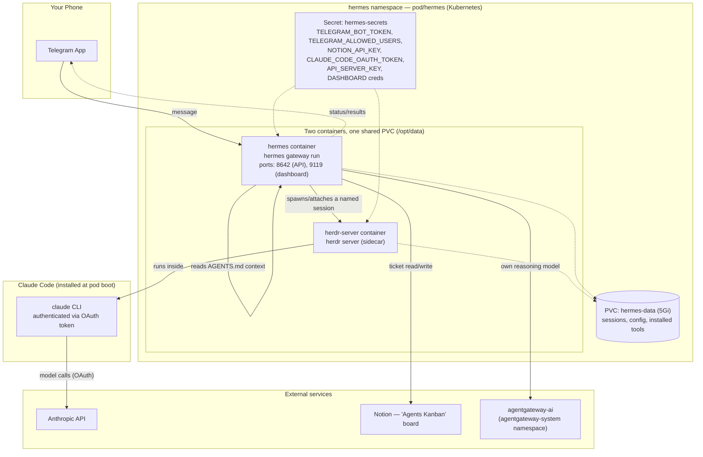
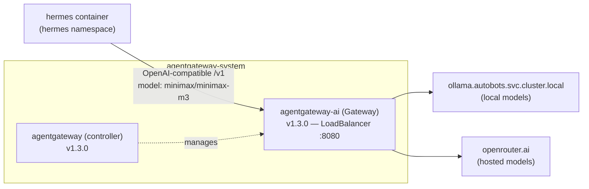
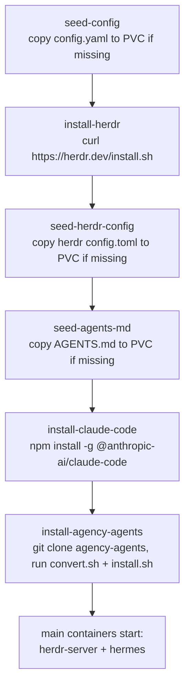
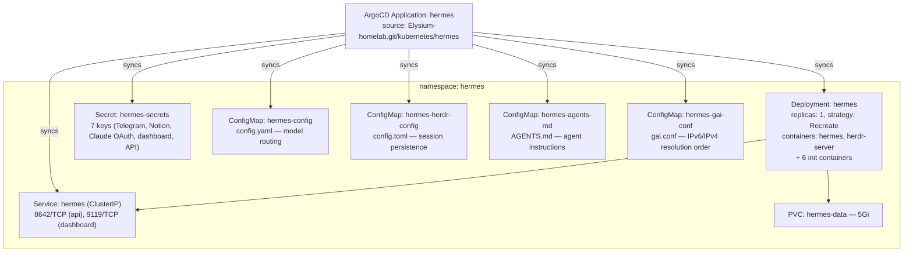

---
Author:
  - Kumail Rizvi
Author Profile:
  - https://linkedin.com/in/kumail-rizvi
tags:
  - AI
  - Kubernetes
  - Claude
  - Homelab
  - Agents
Creation Date: 2026-08-03T00:00:00
Last Date: 2026-08-03T00:00:00
DocID: HH-26
drafts: false
References:
  - https://herdr.dev
  - https://github.com/msitarzewski/agency-agents
  - https://agentgateway.dev
description: How I wired Telegram, Herdr, Hermes, Claude Code, Notion, and a self-hosted AgentGateway together on my Kubernetes homelab so I can hand off real coding work from my phone and have it run unattended.
---

## Abstract
---

I wanted to be able to text a coding task to something from my phone, close the app, and come back later to find it either done or a clear explanation of what it's blocked on — without keeping a laptop open or a terminal session alive. That's the whole motivation behind this stack: **Herdr** (persistent agent sessions), **Hermes** (the Telegram-facing gateway), **Claude Code** (the actual coding agent), **Notion** (the engineering ticket board the agent keeps updated), and **AgentGateway** (a self-hosted AI gateway fronting Ollama and OpenRouter for Hermes' own reasoning model). All of it runs as one pod in a `hermes` namespace on my homelab Kubernetes cluster, deployed via ArgoCD.

This post is a full teardown of that pipeline — what each piece actually does, how the pod is put together, and what happens end-to-end when I send a message.

## The Problem
---

Coding agents are good at long, unattended tasks — but most of them assume you're sitting at a terminal. If you close the laptop, the session dies. If you want to kick off a task from your phone, there's usually no good entry point that isn't "open a remote desktop session."

I wanted three things:
1. **A phone-first entry point** — Telegram, since I already live in it.
2. **Sessions that survive me disconnecting** — closing the Telegram app shouldn't kill the agent's work.
3. **A source of truth for what's in flight** — not just chat history, but an actual ticket board I can glance at.

## Architecture
---

![[herdr-hermes-pipeline.png]]

At the center of this is a single Kubernetes Deployment (`hermes`, in the `hermes` namespace) running **two containers that share a persistent volume**:



Two things worth calling out immediately, because they trip people up:

> [!note] Two different model paths
> Hermes' own "brain" — the reasoning it does to decide what to do with an incoming Telegram message — is a small model (`minimax/minimax-m3`) routed through my self-hosted **AgentGateway**. The actual *coding work*, once Hermes hands it off to Claude Code via Herdr, goes straight to Anthropic's API using a Claude Code OAuth token. These are two separate model calls with two separate purposes — Hermes deciding "what should happen" versus Claude Code actually doing it.

> [!note] `strategy: Recreate`, not `RollingUpdate`
> The Deployment is pinned to `replicas: 1` and `strategy: Recreate`. Herdr sessions are stateful PTYs living on a single pod — running two replicas would mean two independent session stores, and a rolling update would briefly run old and new pods side by side. `Recreate` guarantees the old pod is fully gone before the new one starts, so there's never a split-brain session state.

## The Components
---

### Herdr — persistent sessions for coding agents

[Herdr](https://herdr.dev) is the piece that solves "the agent's work shouldn't die when I disconnect." It's a small server (`herdr server`, running as the `herdr-server` sidecar container) that manages long-lived terminal sessions — conceptually similar to `tmux`, but exposed over a socket API instead of a raw PTY, and specifically built with coding agents in mind.

The instructions baked into this pod's `AGENTS.md` describe it plainly:

```
herdr is installed on PATH and its server runs continuously in a
sidecar container in this pod. Use it to run long-lived coding-agent
work (e.g. Claude Code, OpenCode) that should keep running in the
background and survive you disconnecting or this agent restarting.
```

Key commands the agent has available:
- `herdr session attach <name>` — attach to (or create) a named persistent session
- `herdr pane <subcommand>` — spawn a pane, send input, read output over the socket API, no interactive terminal needed
- `herdr agent <subcommand>` — agent/terminal helpers
- `herdr status` — client/server status

Its config (`/opt/data/herdr/config.toml`) is deliberately minimal:

```toml
[session]
resume_agents_on_restore = true

[experimental]
pane_history = true
```

Both settings matter for the "survives restarts" guarantee: `resume_agents_on_restore` reattaches running agent sessions after the server restarts, and `pane_history` keeps scrollback across restarts so context isn't lost.

### Hermes — the Telegram gateway

The `hermes` container is the other half of the pod, running `hermes gateway run`. This is what actually talks to Telegram, exposes a small dashboard (port `9119`, basic-auth protected) and an API server (port `8642`, key-protected), and decides — based on the `AGENTS.md` context it's given — when to reach for Herdr versus just answering directly.

Environment-wise, it's wired up with:

| Variable | Purpose |
|---|---|
| `TELEGRAM_BOT_TOKEN` / `TELEGRAM_ALLOWED_USERS` | Bot auth + an allowlist, so only I can drive it |
| `NOTION_API_KEY` | Read/write access to the ticket board |
| `CLAUDE_CODE_OAUTH_TOKEN` | Shared with `herdr-server` so Claude Code can authenticate |
| `HERMES_DASHBOARD*` / `DASHBOARD_USERNAME` / `DASHBOARD_PASSWORD` | Web dashboard for checking in on sessions outside Telegram |
| `API_SERVER_KEY` | Auth for Hermes' own HTTP API |

All secrets live in a single `hermes-secrets` Kubernetes Secret, referenced via `secretKeyRef` rather than baked into the image or configmap.

### AgentGateway — a self-hosted AI gateway

Separately, in an `agentgateway-system` namespace, I run [AgentGateway](https://agentgateway.dev) — an actual [Gateway API](https://gateway-api.sigs.k8s.io/) implementation purpose-built for AI traffic. It's not part of the Hermes pod at all; it's shared infrastructure that Hermes' own reasoning model happens to route through:



Hermes' own `config.yaml` points at it directly:

```yaml
model:
  provider: custom
  model: minimax/minimax-m3
  base_url: http://agentgateway-ai.agentgateway-system.svc.cluster.local:8080/v1
  api_key: "none"
```

The gateway fronts both a local Ollama instance and OpenRouter, so which backend actually serves a given model is a routing decision at the gateway, not something Hermes has to know about. `api_key: "none"` because auth happens at the gateway boundary within the cluster, not per-caller.

### The 269-agent roster

Bundled in via an init container is [agency-agents](https://github.com/msitarzewski/agency-agents) — an open-source collection of specialist agent personas organized by department: engineering, marketing, sales, finance, product, design, support, security, testing, and a handful of more niche ones (GIS, healthcare, game development, spatial computing). Counting the actual persona files on disk across those division directories comes out to **269** — which is exactly the number in the diagram above.

Rather than loading all 269 into context, there's a small router plugin (`agency-agents-router`) that exposes four tools instead:

```yaml
name: agency-agents-router
provides_tools:
  - agency_agents_search
  - agency_agents_inspect
  - agency_agents_load
  - agency_agents_delegate
```

This is the difference between "search/inspect/load/delegate on demand" and "stuff 269 personas into every prompt." The agent searches for a relevant persona, inspects it if it looks right, loads it, and can delegate a subtask to it — keeping the base context small regardless of roster size.

### Notion — the "Agents Kanban" board

The last piece is a Notion database that acts as the actual source of truth for engineering work, not just a log of what happened. This is spelled out directly in `AGENTS.md`:

- **Properties**: `Agent` (title — despite the name, this is the task title, not a literal agent name), `Status` (Backlog / Ready / In progress / Blocked / Done), `Priority` (High/Medium/Low), `Notes` (rich text — context, links, progress), `Owner`.
- **Workflow**: create a ticket *before* starting background work via Herdr, keep the same ticket updated as work progresses (not duplicate tickets), move to `Blocked` with an explanation if it needs my input, and write a final `Notes` summary on `Done`.
- If I ask "what are you working on," the instruction is to check the board first — not just recall conversation history.

This matters more than it sounds: chat history is ephemeral and per-thread, but the Kanban board persists and is visible outside of whatever Telegram thread a task started in.

## How the Pod Bootstraps Itself
---

One thing that stood out digging into this: the pod does almost all of its own setup via init containers, against a single shared PVC, rather than baking everything into the image. Each step is idempotent (`test -f ... || ...`), so re-running the pod (e.g. after `Recreate`) skips anything already provisioned on the volume:



Both main containers share a `postStart` hook that symlinks the freshly-installed binaries onto `PATH`:

```sh
ln -sf /opt/data/bin/herdr /usr/local/bin/herdr
ln -sf /opt/data/npm-global/bin/claude /usr/local/bin/claude
```

Everything — the `herdr` binary, the globally-installed `claude` CLI, the cloned `agency-agents` repo, and all session/config state — lives on a single 5Gi PVC (`hermes-data`) mounted at `/opt/data` in both containers. That's what makes "survives pod restarts" actually true: a fresh pod doesn't reinstall from scratch, it just finds everything already there and skips straight to running.

## What Actually Happens When I Send a Message
---

Putting it all together, here's the real end-to-end flow for a coding task sent from Telegram:

1. I send a message in Telegram. The bot only responds to IDs in `TELEGRAM_ALLOWED_USERS`.
2. The `hermes` container picks it up, reasons about it using its own model (routed through AgentGateway → Ollama/OpenRouter), and reads its `AGENTS.md` context — which tells it to use Herdr for anything that should keep running in the background.
3. Hermes creates or attaches a named Herdr session via the socket API. Herdr runs Claude Code inside that session, authenticated with the shared `CLAUDE_CODE_OAUTH_TOKEN`.
4. If the task is non-trivial engineering work, a ticket goes onto the Notion "Agents Kanban" board first — `Status: Ready` or `In progress`, with context in `Notes` — before work actually starts.
5. Claude Code does the work, making model calls straight to the Anthropic API. I can close the Telegram app entirely; the pane keeps running because it's a Herdr session on a persistent volume, not a process tied to my connection.
6. As work progresses, the same Notion ticket gets updated rather than duplicated. If something needs my input, it moves to `Blocked` with an explanation.
7. Status and results come back to me via Telegram, and the final ticket gets a `Done` summary in `Notes`.

## How It's Deployed on Kubernetes
---

Everything lives in its own `hermes` namespace, and the whole thing is deployed via **ArgoCD**, tracked from my homelab's own GitOps repo:

```
Application: hermes
repoURL:     https://github.com/kumailr7/Elysium-homelab.git
path:        kubernetes/hermes
targetRevision: HEAD
tracking-id: hermes:apps/Deployment:hermes/hermes
```

Nothing is `kubectl apply`'d by hand — the Deployment, ConfigMaps, PVC, and Secret references all come from that path in the repo, and ArgoCD reconciles the live cluster state against it. As of writing it's on revision 16 (generation 19), which is a fair number of iterations for something that started as "wire a Telegram bot to a coding agent."

The full object inventory in the namespace:



A few deployment-level details worth calling out:

- **Resource requests/limits are asymmetric across the two containers** — `herdr-server` (the session manager, mostly idle) gets `50m`/`128Mi` requested and `300m`/`384Mi` capped; `hermes` (the container actually running the gateway, dashboard, and API server) gets `100m`/`256Mi` requested and `750m`/`768Mi` capped. The gateway does more work, so it gets more room.
- **`gai.conf` is mounted into `/etc/gai.conf`** in the `hermes` container via a ConfigMap. This is a small but easy-to-miss detail: it's the glibc address-selection config (`getaddrinfo` ordering for IPv4 vs IPv6), and it's common to need a custom one in containers to avoid slow or broken outbound calls when a cluster's IPv6 path is flaky — relevant here since `hermes` is the container making all the outbound calls (Telegram, Notion, AgentGateway).
- **The `Service` only exposes ClusterIP**, not a LoadBalancer or Ingress — Telegram is a pull-based integration (the bot polls/receives via Telegram's own infrastructure), so there's no need to expose anything to the internet. The dashboard and API ports are only reachable from inside the cluster unless I port-forward to them.
- Pod scheduling isn't pinned — it landed on `elysium-w2` (one of three worker nodes) this time around, and would just as happily land on another worker if rescheduled, since all its state lives on the PVC rather than the node's local disk.

> [!tip] Why this is worth the extra moving parts
> It would be simpler to just SSH into a box and run Claude Code in a `tmux` session directly. The reason for the extra layers — Herdr's socket API instead of raw PTY, Hermes as a dedicated gateway instead of a bot script, a real Kubernetes Deployment with GitOps instead of a systemd unit — is that each piece is independently replaceable. I can swap Telegram for Slack by only touching Hermes. I can swap Claude Code for another CLI agent by only touching what Herdr spawns. Nothing about the architecture assumes any one of these tools is permanent.
