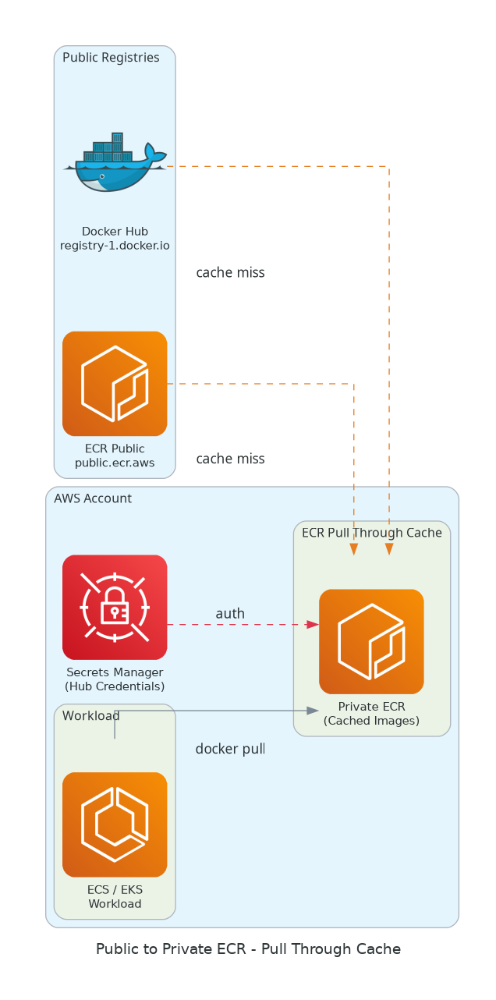
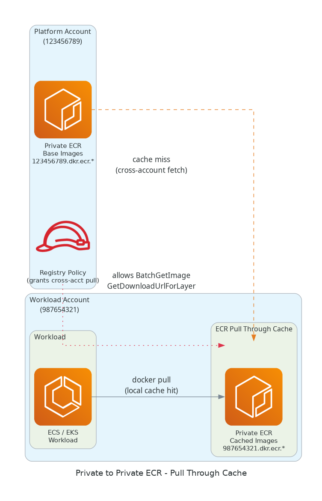

---
Author:
  - Kumail Rizvi
Author Profile:
  - https://linkedin.com/in/kumail-rizvi
tags:
  - AWS
Creation Date: 2026-04-21T00:00:00
Last Date: 2026-04-21T00:00:00
DocID: EC-26
drafts: false
References:
  - https://docs.aws.amazon.com/AmazonECR/latest/userguide/pull-through-cache-creating-rule.html
  - https://docs.aws.amazon.com/AmazonECR/latest/userguide/pull-through-cache.html
description: A practical guide to ECR Pull Through Cache — caching public and private registry images into your own private ECR, reducing latency, cost, and external dependency.
Github Link:
---

## Abstract
---
ECR **Pull Through Cache** lets you mirror container images from upstream registries into your own **Amazon ECR private registry** automatically — on first pull. Instead of hitting Docker Hub or a remote ECR every time, your workloads pull from a local cache that stays fresh.

> [!tip] Why It Matters
> Reduces egress costs, eliminates rate-limit issues (Docker Hub), speeds up cold starts, and gives you a single controlled source of truth for images.

---

## How Pull Through Cache Works
---

```
Developer / ECS / EKS
        │
        ▼
  Private ECR (your account)
  ecr.aws/<prefix>/library/nginx:latest
        │  ← cache miss? fetch upstream
        ▼
  Upstream Registry
  (Docker Hub / ECR Public / another Private ECR)
```

1. You define a **cache rule** — mapping a namespace prefix in your private ECR to an upstream registry.
2. On first `docker pull`, ECR fetches from upstream, stores it in your registry.
3. Subsequent pulls hit the **local cache** (refreshed every 24 hours automatically).

---

## Scenario 1 — Public to Private (Docker Hub → ECR)
---

This is the most common use case: cache Docker Hub or ECR Public images to avoid rate limits and reduce pull latency.

**Supported upstream registries:**
- Docker Hub (`registry-1.docker.io`)
- ECR Public (`public.ecr.aws`)
- Quay, Kubernetes Registry, GitHub Container Registry

**Steps:**

```bash
# 1. Create a secret in Secrets Manager (for Docker Hub auth)
aws secretsmanager create-secret \
  --name ecr-pullthroughcache/docker \
  --secret-string '{"username":"<hub_user>","accessToken":"<hub_token>"}'

# 2. Create the pull-through cache rule
aws ecr create-pull-through-cache-rule \
  --ecr-repository-prefix "dockerhub" \
  --upstream-registry-url "registry-1.docker.io" \
  --credential-arn arn:aws:secretsmanager:<region>:<account>:secret:ecr-pullthroughcache/docker
```

**Pull image via cache:**
```bash
docker pull <account>.dkr.ecr.<region>.amazonaws.com/dockerhub/library/nginx:latest
```

> [!note] IAM Requirement
> Your IAM role/user needs `ecr:CreateRepository` — ECR auto-creates the mirrored repo on first pull.

---

## Scenario 2 — Private to Private (Cross-Account ECR → ECR)
---

> [!info] Available since 2023
> You can now use **another private ECR registry** (even cross-account) as an upstream for pull-through cache.

**Use case:** Centralised image registry in a platform/tooling account → cache into workload accounts.

```
Platform Account ECR (source)
  123456789.dkr.ecr.us-east-1.amazonaws.com/base-images/

        Pull Through Cache Rule
                │
                ▼

Workload Account ECR (cache destination)
  987654321.dkr.ecr.us-east-1.amazonaws.com/platform/base-images/app:v1
```

**Steps:**

```bash
# In workload account — create cache rule pointing to platform account ECR
aws ecr create-pull-through-cache-rule \
  --ecr-repository-prefix "platform" \
  --upstream-registry-url "123456789.dkr.ecr.us-east-1.amazonaws.com" \
  --upstream-registry "ecr"
```

> [!caution] Cross-Account Permissions
> The **source ECR** must grant `ecr:BatchGetImage` and `ecr:GetDownloadUrlForLayer` to the destination account via a **registry policy**.

```json
{
  "Version": "2012-10-17",
  "Statement": [{
    "Effect": "Allow",
    "Principal": { "AWS": "arn:aws:iam::987654321:root" },
    "Action": [
      "ecr:BatchGetImage",
      "ecr:GetDownloadUrlForLayer",
      "ecr:DescribeImages"
    ]
  }]
}
```

---

## Scenario 1 Architecture — Public to Private
---



## Scenario 2 Architecture — Private to Private
---



---

## Key Considerations
---

| Aspect | Detail |
|--------|--------|
| **Cache refresh** | Every 24 hours (automatic) |
| **Repo auto-creation** | ECR creates mirrored repos on first pull |
| **IAM needed** | `ecr:CreateRepository`, `ecr:BatchImportUpstreamImage` |
| **Secrets Manager** | Required for authenticated upstreams (Docker Hub) |
| **Cross-account** | Source registry needs a registry policy granting pull access |
| **Supported upstreams** | Docker Hub, ECR Public, ECR Private, Quay, k8s.gcr.io, GHCR |

---

## References
---
- [AWS Docs — Creating a pull-through cache rule](https://docs.aws.amazon.com/AmazonECR/latest/userguide/pull-through-cache-creating-rule.html)
- [AWS Docs — Pull through cache overview](https://docs.aws.amazon.com/AmazonECR/latest/userguide/pull-through-cache.html)
